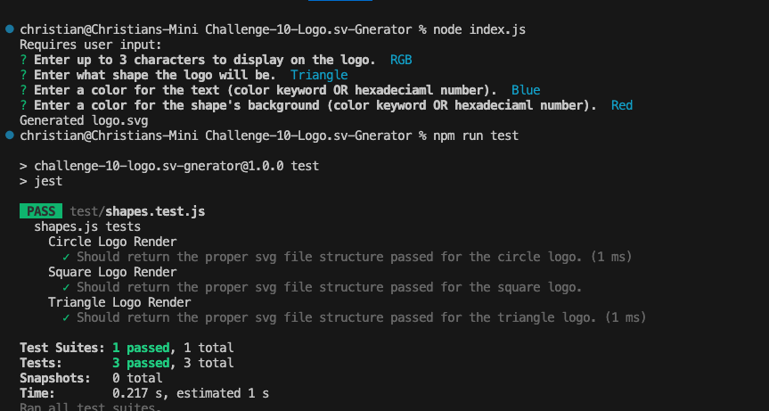

# Challenge-10-Logo.svg-Generator

## Description 
  Using command line arguments, creates a logo.svg from user inputs.

## Table of Contents
  
  - [Description](#description)
  - [Installation](#installation)
  - [Usage](#usage)
  - [License](#license)
  - [Testing](#testing)
  - [Questions](#questions)
  - [Video](#video)

## Installation
  Install with node using node with the command line input 
  
    npm install

  in the command line

## Usage
  run app by using 
  
    node index.js

  in the command line

  

## License
  This application is licensed under the [MIT](https://choosealicense.com/licenses/mit/) license
  
## Testing
  Use the command 

    npm run test

  in the command line
  
## Questions
  Created by: [cgwol](https://github.com/cgwol/)

## Video
    [Video Link](https://drive.google.com/file/d/1iLrbAZHkmm8xVVBvXWi4_0dkTrlivfD-/view?usp=sharing "Video Link")
